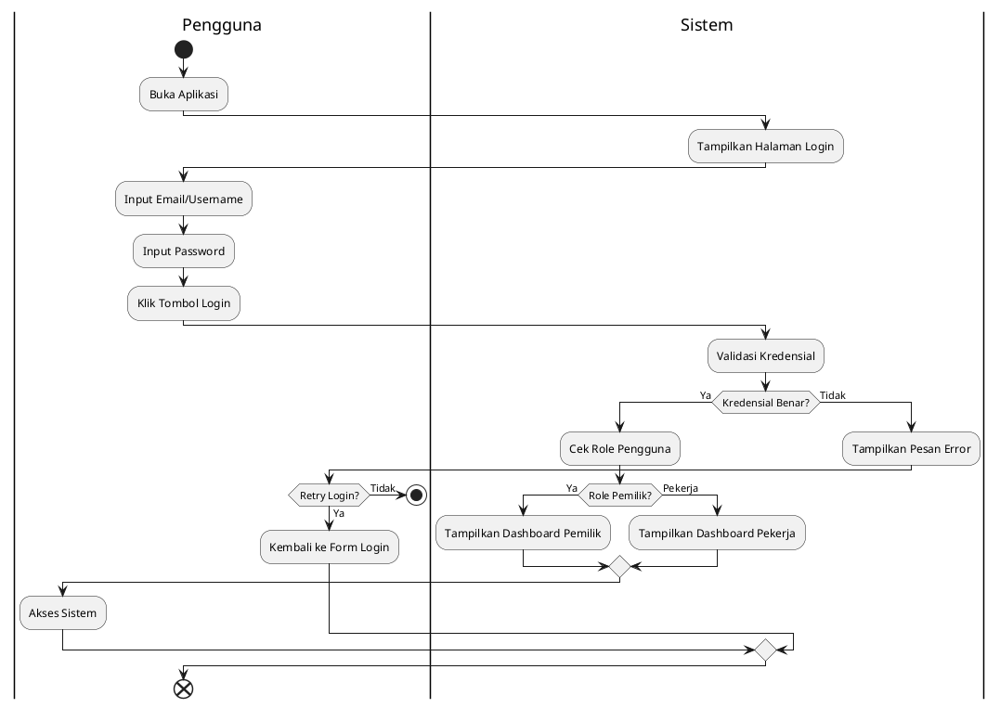
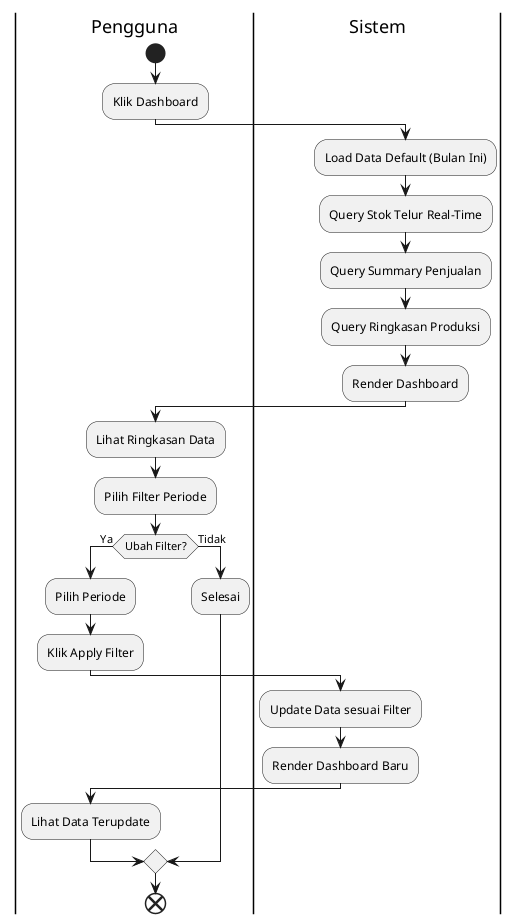
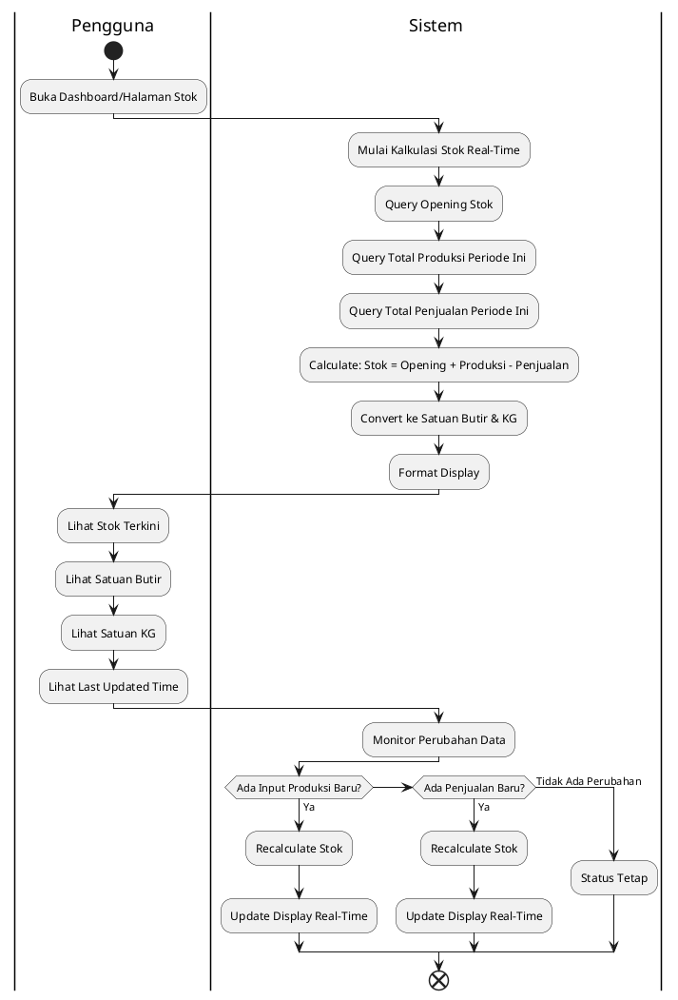
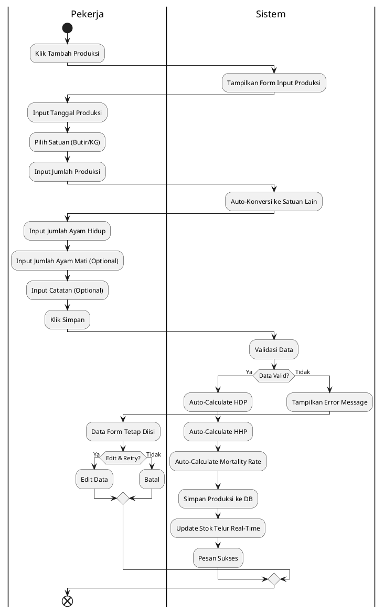

# ACTIVITY DIAGRAM
## Hans Jaya Poultry Farm Management System

**Tanggal Analisis:** 11 April 2026  
**Deskripsi:** Diagram aktivitas menggunakan PlantUML untuk menggambarkan alur proses sistem secara mendetail

---

## A. ACTIVITY DIAGRAM - LOGIN

Activity diagram untuk use case Login menggambarkan alur lengkap dari user mencoba login hingga berhasil atau gagal masuk ke sistem.



---

## B. ACTIVITY DIAGRAM - LIHAT DASHBOARD

Activity diagram untuk use case Lihat Dashboard menggambarkan alur tampilan ringkasan data.



---

## C. ACTIVITY DIAGRAM - KELOLA HARGA TELUR

Activity diagram untuk use case Kelola Harga Telur menggambarkan operasi CRUD harga dengan auto-hangus logic.

```plantuml
@startuml
|Pemilik|
start
:Buka Halaman Harga;
|Sistem|
:Tampilkan Daftar Harga (Aktif & Hangus);
|Pemilik|
repeat
  if (Pilih Aksi?) then (Tambah Harga)
    :Input Data Harga Baru;
    :Pilih Jenis Harga;
    :Input Harga per KG;
    if (Input Harga per Butir Manual?) then (Ya)
      :Input Harga per Butir;
    else (Tidak)
      |Sistem|
      :Auto-Calculate Harga per Butir;
    endif
    |Pemilik|
    :Input Tanggal Berlaku;
    :Klik Simpan;
    |Sistem|
    :Validasi Data;
    if (Data Valid?) then (Ya)
      :Cari Harga Aktif Jenis Sama;
      :Tandai Harga Lama sebagai Hangus;
      :Simpan Harga Baru sebagai Aktif;
      :Pesan Sukses;
    else (Tidak)
      :Tampilkan Error;
    endif
  else if (Edit Harga) then (Edit)
    :Pilih Harga yang Aktif;
    |Sistem|
    :Load Data Harga;
    |Pemilik|
    :Ubah Harga/Tanggal;
    :Klik Simpan;
    |Sistem|
    :Validasi Data;
    if (Valid?) then (Ya)
      :Update Harga;
      :Pesan Sukses;
    else (Tidak)
      :Tampilkan Error;
    endif
  else if (Tandai Hangus) then (Hangus)
    :Pilih Harga Aktif;
    |Sistem|
    :Tampilkan Konfirmasi;
    |Pemilik|
    if (Confirm Hangus?) then (Ya)
      |Sistem|
      :Set Status Hangus;
      :Set Tanggal Akhir;
      :Simpan ke Database;
      :Pesan Sukses;
    else (Tidak)
      :Batal;
    endif
  else if (Lihat History) then (History)
    |Sistem|
    :Query Semua Harga (Aktif & Hangus);
    :Tampilkan Tabel History;
    :Tampilkan Grafik History Harga;
    |Pemilik|
    :Lihat History Lengkap;
  endif
until (Lanjut Operasi?)
end
@enduml
```

---

## D. ACTIVITY DIAGRAM - INPUT PENJUALAN TELUR

Activity diagram untuk use case Input Penjualan dengan multi-item dan atomic transaction.

```plantuml
@startuml
|Pemilik|
start
:Klik Tambah Penjualan;
|Sistem|
:Tampilkan Form Penjualan;
|Pemilik|
:Input Tanggal Jual;
:Input Jam Jual;
:Input Nama Pembeli;
repeat
  :Klik Tambah Item;
  |Sistem|
  :Tampilkan Form Input Item;
  |Pemilik|
  :Pilih Harga dari Master;
  :Pilih Satuan Jual;
  :Input Jumlah;
  |Sistem|
  :Auto-Konversi Satuan;
  :Auto-Calculate Subtotal;
  :Snapshot Harga Saat Jual;
  |Pemilik|
  :Review Item;
  :Klik Simpan Item;
  |Sistem|
  :Tambah Item ke Daftar;
  |Pemilik|
until (Tambah Item Lagi?)
:Klik Proses Penjualan;
|Sistem|
:Validasi Stok Total;
if (Stok Cukup?) then (Ya)
  :Start Database Transaction;
  :Kurangi Stok Telur;
  :Simpan Data Penjualan;
  :Simpan Semua Detail Items;
  if (Commit Sukses?) then (Ya)
    :Pesan Sukses;
    :Tampilkan Invoice;
  else (Gagal)
    :Rollback Transaksi;
    :Tampilkan Error;
  endif
else (Tidak)
  :Tampilkan Warning "Stok Tidak Cukup";
  |Pemilik|
  if (Lanjut?) then (Ya)
    :Kurangi Jumlah Item;
  else (Tidak)
    :Batal Penjualan;
  endif
endif
end
@enduml
```

---

## E. ACTIVITY DIAGRAM - LIHAT LAPORAN PENJUALAN

Activity diagram untuk use case Lihat Laporan Penjualan dengan filtering dan export.

```plantuml
@startuml
|Pemilik|
start
:Buka Laporan Penjualan;
|Sistem|
:Load Data Default (Bulan Ini);
:Query Total Penjualan;
:Query Breakdown per Jenis Harga;
:Kalkulasi Revenue;
:Render Tabel & Grafik;
|Pemilik|
:Lihat Summary Penjualan;
:Lihat Tabel Detail;
:Lihat Grafik Trend;
repeat
  if (Ubah Filter?) then (Ya)
    :Pilih Periode Filter;
    if (Pilih Kandang?) then (Ya)
      :Pilih Kandang Tertentu;
    else (Semua Kandang)
    endif
    :Klik Apply Filter;
    |Sistem|
    :Query Data dengan Filter;
    if (Ada Data?) then (Ya)
      :Render Laporan Baru;
    else (Tidak Ada)
      :Pesan "Belum Ada Data";
    endif
    |Pemilik|
  else (Tidak)
  endif
  if (Export?) then (Ya)
    if (Format?) then (PDF)
      |Sistem|
      :Generate PDF;
      :Download File;
      |Pemilik|
      :File Tersimpan;
    else (Excel)
      |Sistem|
      :Generate Excel;
      :Download File;
      |Pemilik|
      :File Tersimpan;
    endif
  else (Tidak)
  endif
until (Selesai?)
end
@enduml
```

---

## F. ACTIVITY DIAGRAM - KELOLA USER

Activity diagram untuk use case Kelola User menggambarkan CRUD user dengan role assignment.

```plantuml
@startuml
|Pemilik|
start
:Buka Kelola User;
|Sistem|
:Tampilkan Daftar User;
|Pemilik|
repeat
  if (Aksi?) then (Tambah)
    :Klik Tambah User;
    |Sistem|
    :Tampilkan Form Input;
    |Pemilik|
    :Input Nama;
    :Input Email;
    :Input Password;
    :Pilih Role;
    if (Role Pekerja?) then (Ya)
      :Pilih Kandang;
    else (Pemilik)
    endif
    :Klik Simpan;
    |Sistem|
    :Validasi Email Unique;
    if (Valid?) then (Ya)
      :Hash Password;
      :Simpan User ke DB;
      :Assign Role;
      if (Pekerja?) then (Ya)
        :Assign Kandang;
      endif
      :Pesan Sukses;
    else (Tidak)
      :Tampilkan Error;
    endif
  else if (Edit) then (Edit)
    :Pilih User;
    |Sistem|
    :Load Data User;
    |Pemilik|
    :Edit Name/Email/Role;
    :Klik Simpan;
    |Sistem|
    :Validasi Data;
    if (Valid?) then (Ya)
      :Update User;
      :Update Role/Kandang jika berubah;
      :Pesan Sukses;
    else (Tidak)
      :Error;
    endif
  else if (Hapus) then (Hapus)
    :Pilih User;
    |Sistem|
    :Tampilkan Konfirmasi;
    |Pemilik|
    if (Confirm?) then (Ya)
      |Sistem|
      :Hapus User;
      :Hapus Permission Terkait;
      :Pesan Sukses;
    else (Tidak)
      :Batal;
    endif
  endif
until (Selesai?)
end
@enduml
```

---

## G. ACTIVITY DIAGRAM - PENGATURAN SISTEM

Activity diagram untuk use case Kelola Pengaturan menggambarkan edit konfigurasi sistem.

```plantuml
@startuml
|Pemilik|
start
:Buka Pengaturan Sistem;
|Sistem|
:Query Semua Setting;
:Tampilkan Daftar Setting;
|Pemilik|
:Lihat Nilai Setting Terkini;
:Lihat Keterangan Setting;
repeat
  :Pilih Setting untuk Diubah;
  :Input Nilai Baru;
  if (Konversi Butir/KG?) then (Ya)
    :Edit Ratio Konversi;
  else (Setting Lain)
    :Edit Nilai Sesuai Tipe;
  endif
  :Klik Simpan;
  |Sistem|
  :Validasi Nilai;
  if (Valid?) then (Ya)
    :Update Setting di Database;
    :Pesan "Setting Updated";
  else (Tidak)
    :Tampilkan Error;
    |Pemilik|
    :Edit Ulang;
  endif
until (Selesai?)
end
@enduml
```

---

## H. ACTIVITY DIAGRAM - LIHAT STOK REAL-TIME

Activity diagram untuk use case Lihat Stok Real-Time menggambarkan kalkulasi stok dinamis.



---

## SUMMARY - ALUR KESELURUHAN SISTEM

```plantuml
@startuml
start
:User Buka Aplikasi;
if (Sudah Login?) then (Ya)
  :Skip Login;
else (Tidak)
  :Login dengan Email & Password;
  :Validasi Kredensial;
endif
:Tampilkan Dashboard;
if (Role?) then (Pemilik)
  :Akses Semua Fitur;
  repeat
    if (Menu?) then (Kandang)
      :Kelola Kandang (CRUD);
    else if (Harga) then
      :Kelola Harga (CRUD);
    else if (Penjualan) then
      :Input Penjualan Multi-Item;
      :Validasi & Proses;
    else if (Laporan) then
      :Lihat Laporan (Produksi/Penjualan/Stok);
      :Filter & Export;
    else if (User) then
      :Kelola User (CRUD);
    else if (Setting) then
      :Pengaturan Sistem;
    else if (Profil) then
      :Edit Profil;
    endif
  until (Logout?)
else (Pekerja)
  :Akses Fitur Terbatas;
  repeat
    if (Menu?) then (Produksi)
      :Input Produksi Harian;
      :Auto-Calc Metrics;
      :Update Stok;
    else if (Dashboard) then
      :Lihat Dashboard Terbatas;
    else if (Profil) then
      :Edit Profil;
    endif
  until (Logout?)
endif
:Logout;
:Session Berakhir;
end
@enduml
```

---

**Catatan Penggunaan PlantUML:**
1. Copy kode di atas ke [PlantUML Online Editor](https://www.plantuml.com/plantuml/uml/)
2. Atau install PlantUML di lokal dan render dengan tool favorit Anda
3. Semua diagram sudah dalam format PlantUML yang siap dipreview
4. Format lebih clean dan mudah di-maintain dibanding ASCII art

---

## B. ACTIVITY DIAGRAM - INPUT PRODUKSI TELUR

Activity diagram untuk use case Input Produksi Telur menggambarkan alur pekerja menginput data produksi harian.




---

## D. ACTIVITY DIAGRAM - LIHAT LAPORAN PRODUKSI

Activity diagram untuk use case Lihat Laporan Produksi menggambarkan alur filtering dan export data.

```plantuml
@startuml
|Pemilik|
start
:Buka Laporan Produksi;
|Sistem|
:Load Data Default (Bulan Ini);
:Query Data Produksi;
:Kalkulasi Summary (Total, Rata-rata);
:Render Tabel & Grafik;
|Pemilik|
:Lihat Summary Produksi;
:Lihat Tabel Detail;
:Lihat Grafik Trend;
repeat
  if (Ubah Filter?) then (Ya)
    :Pilih Periode (Harian/Bulanan/3-bulan/6-bulan);
    if (Ubah Kandang?) then (Ya)
      :Pilih Kandang;
    endif
    :Klik Apply Filter;
    |Sistem|
    :Query Data dengan Filter;
    if (Ada Data?) then (Ya)
      :Tampilkan Data Baru;
    else (Tidak)
      :Pesan "Belum Ada Data";
    endif
    |Pemilik|
  else (Tidak)
    :Lanjut;
  endif
  if (Export?) then (Ya)
    :Pilih Format Export;
    if (Format?) then (PDF)
      |Sistem|
      :Generate PDF;
    else (Excel)
      |Sistem|
      :Generate Excel;
    endif
    :Download File;
  else (Tidak)
    :Selesai;
  endif
until (Selesai?)
end
@enduml
```

---

## E. ACTIVITY DIAGRAM - KELOLA KANDANG

Activity diagram untuk use case Kelola Kandang menggambarkan operasi CRUD kandang.

```plantuml
@startuml
|Pemilik|
start
:Buka Kelola Kandang;
|Sistem|
:Tampilkan Daftar Kandang;
|Pemilik|
repeat
  if (Pilih Aksi?) then (Tambah)
    :Klik Tombol Tambah;
    |Sistem|
    :Tampilkan Form Input;
    |Pemilik|
    :Input Nama Kandang;
    :Input Jumlah Ayam;
    :Input Keterangan;
    :Input PIC;
    :Klik Simpan;
    |Sistem|
    :Validasi Data;
    if (Valid?) then (Ya)
      :Simpan ke Database;
      :Pesan Sukses;
    else (Tidak)
      :Tampilkan Error;
      |Pemilik|
      :Edit Data;
    endif
  else if (Edit) then (Edit)
    :Pilih Kandang;
    |Sistem|
    :Load Data Kandang;
    :Tampilkan Form Edit;
    |Pemilik|
    :Edit Data;
    :Klik Simpan;
    |Sistem|
    :Validasi Data;
    if (Valid?) then (Ya)
      :Update Database;
      :Pesan Sukses;
    else (Tidak)
      :Error;
    endif
  else if (Hapus) then (Hapus)
    :Pilih Kandang;
    |Sistem|
    :Tampilkan Konfirmasi;
    |Pemilik|
    if (Confirm?) then (Ya)
      |Sistem|
      :Hapus Kandang & Data Terkait;
      :Pesan Sukses;
    else (Tidak)
      :Batal;
    endif
  endif
until (Selesai?)
end
@enduml
```

---

## F. ACTIVITY DIAGRAM - LIHAT STOK REAL-TIME

Activity diagram untuk use case Lihat Stok Real-Time menggambarkan kalkulasi stok dinamis.


---

## G. ACTIVITY DIAGRAM - KELOLA USER

Activity diagram untuk use case Kelola User menggambarkan manajemen pengguna sistem.

```plantuml
@startuml
|Pemilik|
start
:Buka Halaman User;
|Sistem|
:Tampilkan Daftar User;
|Pemilik|
repeat
  if (Aksi?) then (Tambah)
    :Klik Tambah User;
    |Sistem|
    :Tampilkan Form Input;
    |Pemilik|
    :Input Nama;
    :Input Email;
    :Input Password;
    :Pilih Role;
    if (Role Pekerja?) then (Ya)
      :Pilih Kandang;
    else (Pemilik)
    endif
    :Klik Simpan;
    |Sistem|
    :Validasi Email Unique;
    if (Valid?) then (Ya)
      :Hash Password;
      :Simpan User ke DB;
      :Assign Role;
      if (Pekerja?) then (Ya)
        :Assign Kandang;
      endif
      :Pesan Sukses;
    else (Tidak)
      :Tampilkan Error;
    endif
  else if (Edit) then (Edit)
    :Pilih User;
    |Sistem|
    :Load Data User;
    |Pemilik|
    :Edit Name/Email/Role;
    :Klik Simpan;
    |Sistem|
    :Validasi Data;
    if (Valid?) then (Ya)
      :Update User;
      :Update Role/Kandang jika berubah;
      :Pesan Sukses;
    else (Tidak)
      :Error;
    endif
  else if (Hapus) then (Hapus)
    :Pilih User;
    |Sistem|
    :Tampilkan Konfirmasi;
    |Pemilik|
    if (Confirm?) then (Ya)
      |Sistem|
      :Hapus User;
      :Hapus Permission Terkait;
      :Pesan Sukses;
    else (Tidak)
      :Batal;
    endif
  endif
until (Selesai?)
end
@enduml
```

---

## H. ACTIVITY DIAGRAM - PENGATURAN SISTEM

Activity diagram untuk use case Kelola Pengaturan menggambarkan edit konfigurasi sistem.

```plantuml
@startuml
|Pemilik|
start
:Buka Pengaturan Sistem;
|Sistem|
:Query Semua Setting;
:Tampilkan Daftar Setting;
|Pemilik|
:Lihat Nilai Setting Terkini;
:Lihat Keterangan Setting;
repeat
  :Pilih Setting untuk Diubah;
  :Input Nilai Baru;
  if (Konversi Butir/KG?) then (Ya)
    :Edit Ratio Konversi;
  else (Setting Lain)
    :Edit Nilai Sesuai Tipe;
  endif
  :Klik Simpan;
  |Sistem|
  :Validasi Nilai;
  if (Valid?) then (Ya)
    :Update Setting di Database;
    :Pesan "Setting Updated";
  else (Tidak)
    :Tampilkan Error;
    |Pemilik|
    :Edit Ulang;
  endif
until (Selesai?)
end
@enduml
```

---

## I. SUMMARY - ALUR KESELURUHAN SISTEM

```plantuml
@startuml
start
:User Buka Aplikasi;
if (Sudah Login?) then (Ya)
  :Skip Login;
else (Tidak)
  :Login dengan Email & Password;
  :Validasi Kredensial;
endif
:Tampilkan Dashboard;
if (Role?) then (Pemilik)
  :Akses Semua Fitur;
  repeat
    if (Menu?) then (Kandang)
      :Kelola Kandang (CRUD);
    else if (Harga) then
      :Kelola Harga (CRUD);
    else if (Penjualan) then
      :Input Penjualan Multi-Item;
      :Validasi & Proses;
    else if (Laporan) then
      :Lihat Laporan (Produksi/Penjualan/Stok);
      :Filter & Export;
    else if (User) then
      :Kelola User (CRUD);
    else if (Setting) then
      :Pengaturan Sistem;
    else if (Profil) then
      :Edit Profil;
    endif
  until (Logout?)
else (Pekerja)
  :Akses Fitur Terbatas;
  repeat
    if (Menu?) then (Produksi)
      :Input Produksi Harian;
      :Auto-Calc Metrics;
      :Update Stok;
    else if (Dashboard) then
      :Lihat Dashboard Terbatas;
    else if (Profil) then
      :Edit Profil;
    endif
  until (Logout?)
endif
:Logout;
:Session Berakhir;
end
@enduml
```

---

## KETERANGAN SIMBOL ACTIVITY DIAGRAM

| Simbol | Nama | Fungsi |
|--------|------|--------|
| ● | Initial Node (Start) | Menandai awal dari alur aktivitas |
| ○ | Final Node (End) | Menandai akhir dari alur aktivitas |
| ◇ | Decision/Merge Node | Percabangan atau penggabungan alur berdasarkan kondisi |
| ▭ | Activity/Action | Aktivitas yang dilakukan oleh actor atau sistem |
| → | Flow/Arrow | Menunjukkan arah alur aktivitas |
| ┃ | Swimlane (Vertical) | Memisahkan tanggung jawab antara actor dan sistem |

---

**Catatan:** Activity diagram di atas merepresentasikan alur proses secara detail untuk setiap use case utama sistem Hans Jaya Poultry Farm Management System. Diagram membantu tim development dan stakeholder memahami step-by-step bagaimana sistem bekerja dari perspektif user maupun sistem.

*Last Updated: 11 April 2026*